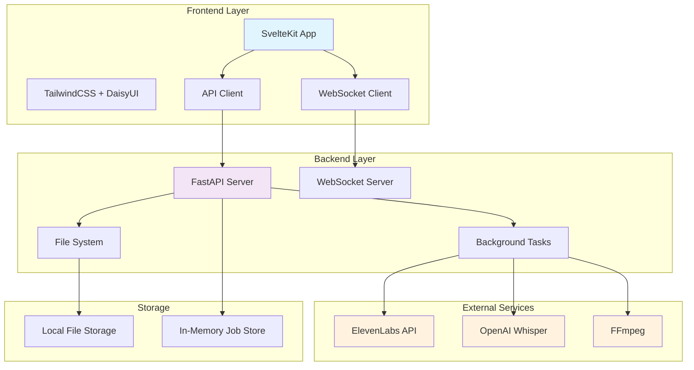
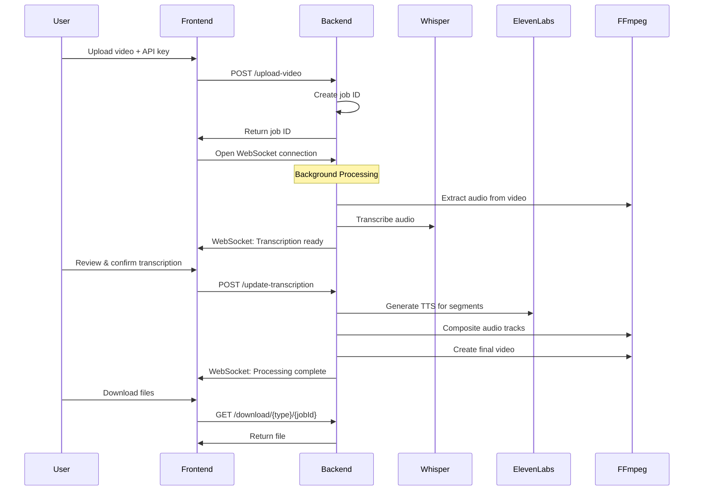
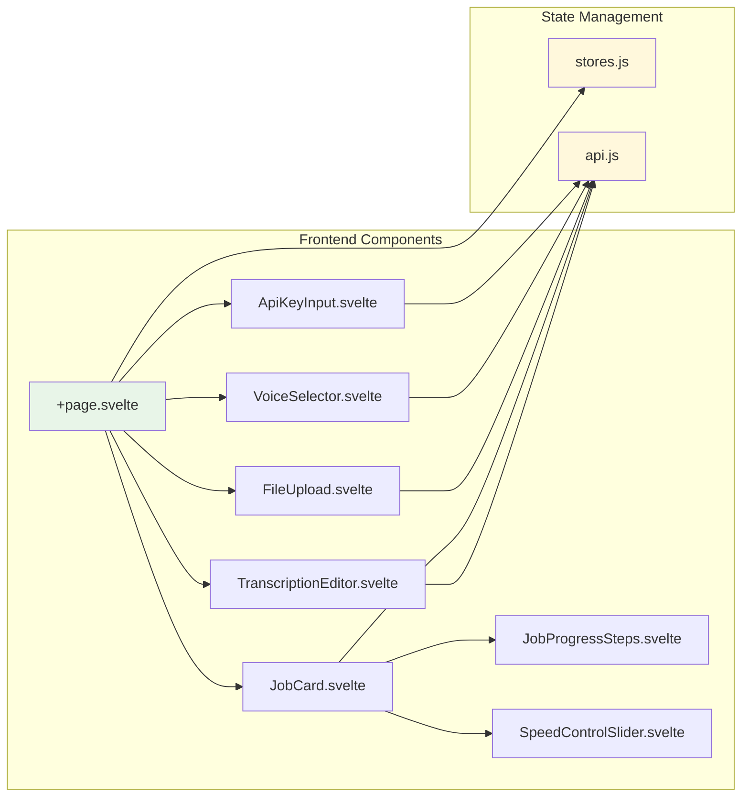
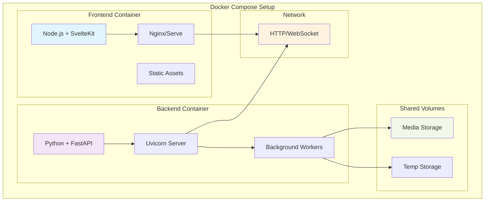
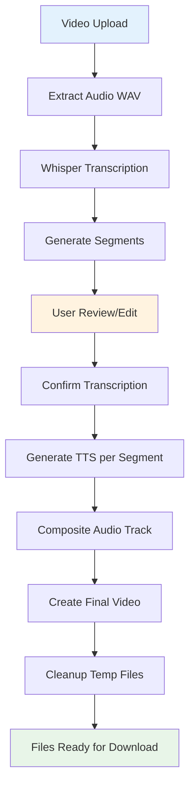
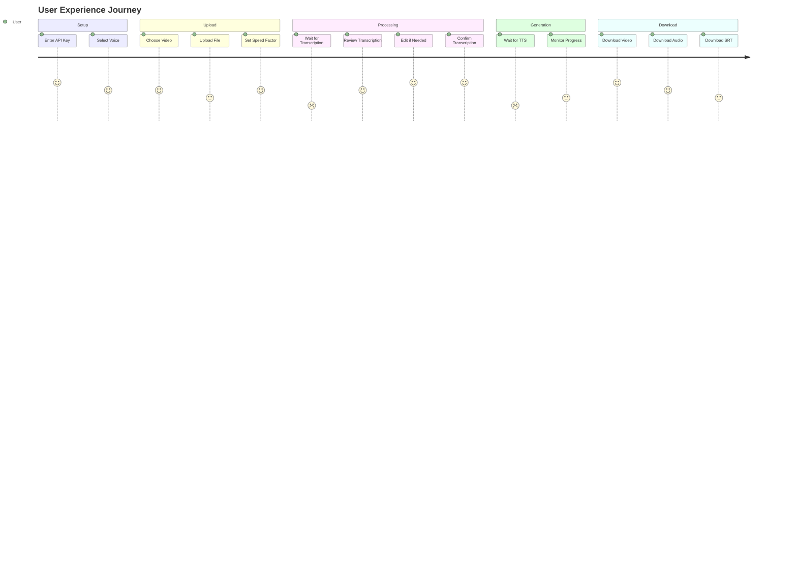
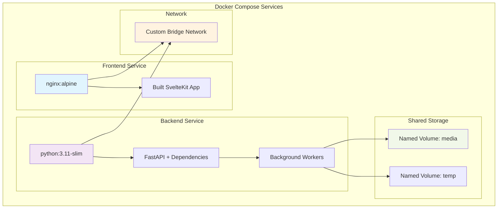
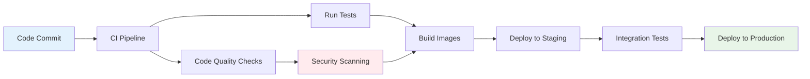
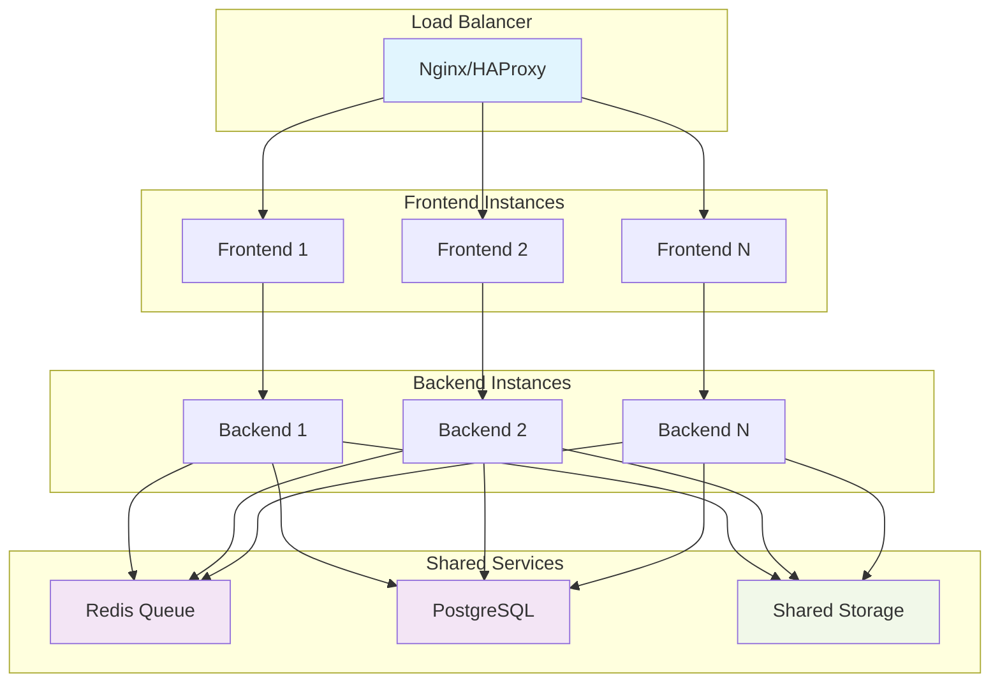

# AutoDubber: Comprehensive Codebase Analysis

## Executive Summary

AutoDubber is a sophisticated web application that leverages AI technologies to automatically generate voiceovers for videos. It uses OpenAI's Whisper for transcription and ElevenLabs for text-to-speech synthesis, providing users with a seamless workflow to replace original video audio with high-quality AI-generated voiceovers.

---

## 🏗️ Software Architecture Analysis

### System Architecture Overview



### Data Flow Architecture



### Component Architecture



### Deployment Architecture



---

## 💻 Software Developer Analysis

### Frontend Technology Stack

**Framework & Build Tools:**
- **SvelteKit 2.16.0**: Modern reactive framework with SSR capabilities
- **Vite 6.2.6**: Fast build tool and dev server
- **TailwindCSS 3.4.17**: Utility-first CSS framework
- **DaisyUI 5.0.35**: Component library for TailwindCSS

**Key Frontend Features:**
1. **Real-time Updates**: WebSocket integration for live job status
2. **Responsive Design**: TailwindCSS responsive utilities
3. **State Management**: Svelte stores for reactive state
4. **Component Architecture**: Modular, reusable components

### Backend Technology Stack

**Core Framework:**
- **FastAPI 0.110.0**: Modern Python web framework
- **Uvicorn 0.28.0**: ASGI server implementation
- **WebSockets 12.0**: Real-time communication

**AI/ML Dependencies:**
- **OpenAI Whisper 20231117**: Speech-to-text transcription
- **ElevenLabs 0.2.26**: Text-to-speech synthesis
- **PyTorch 2.1.2**: ML framework (Whisper dependency)

**Media Processing:**
- **MoviePy 1.0.3**: Video/audio manipulation
- **FFmpeg-Python 0.2.0**: Video processing bindings

### Code Quality Analysis

**Strengths:**
1. **Modular Architecture**: Clear separation of concerns
2. **Type Safety**: Python type hints and Pydantic models
3. **Error Handling**: Comprehensive exception management
4. **Real-time Communication**: Efficient WebSocket implementation
5. **Background Processing**: Async task management

**Areas for Improvement:**
1. **Data Persistence**: Currently uses in-memory storage
2. **Testing Coverage**: No test files present
3. **Configuration Management**: Hardcoded configurations
4. **Security**: API keys stored in frontend state
5. **Monitoring**: No logging/metrics infrastructure

### API Design Analysis

```mermaid
graph LR
    subgraph "REST Endpoints"
        A[POST /upload-video]
        B[GET /jobs]
        C[GET /jobs/{id}]
        D[POST /jobs/{id}/update-transcription]
        E[POST /jobs/{id}/adjust-speed]
        F[GET /voices]
        G[GET /download/{type}/{id}]
    end
    
    subgraph "WebSocket"
        H[WS /ws/{job_id}]
    end
    
    subgraph "Static Files"
        I[/media/* Static Serving]
    end
    
    style A fill:#ffebee
    style H fill:#e8f5e8
    style I fill:#fff3e0
```

**API Design Patterns:**
- RESTful resource-based URLs
- Form data for file uploads
- JSON for structured data
- WebSocket for real-time updates
- Static file serving for downloads

### File Processing Pipeline



---

## 📊 Product Manager Analysis

### User Journey & Features



### Feature Analysis

**Core Features:**
1. **Video Upload & Processing**
   - Supports MP4, MOV, AVI, WEBM
   - 2GB file size limit
   - Progress tracking

2. **AI Transcription**
   - OpenAI Whisper integration
   - Editable transcription interface
   - SRT subtitle generation

3. **Voice Synthesis**
   - ElevenLabs voice selection
   - Custom speed adjustment (0.7x - 1.2x)
   - High-quality multilingual TTS

4. **Real-time Monitoring**
   - WebSocket progress updates
   - Detailed processing stages
   - Error handling and notifications

5. **File Management**
   - Multiple output formats
   - Direct download links
   - Automatic cleanup

### User Experience Strengths

1. **Intuitive Workflow**: Clear step-by-step process
2. **Real-time Feedback**: Live progress updates
3. **Flexibility**: Editable transcriptions and speed control
4. **Multiple Outputs**: Video, audio, and subtitle files
5. **Error Recovery**: Detailed error messages

### Business Model Considerations

**Revenue Streams:**
- SaaS subscription model
- Pay-per-processing usage
- API access licensing
- White-label solutions

**Cost Structure:**
- ElevenLabs API costs (primary variable cost)
- Compute infrastructure
- Storage costs
- Development and maintenance

### Market Positioning

**Target Users:**
- Content creators and YouTubers
- Educational institutions
- Marketing agencies
- Accessibility services
- International businesses

**Competitive Advantages:**
- High-quality ElevenLabs voices
- Real-time processing updates
- Editable transcriptions
- Multiple output formats
- Open-source flexibility

---

## 🐳 Docker Containerization Strategy

### Recommended Docker Setup



### Docker Configuration Files

**docker-compose.yml:**
```yaml
version: '3.8'

services:
  frontend:
    build:
      context: ./frontend
      dockerfile: Dockerfile
    ports:
      - "3000:80"
    environment:
      - VITE_API_BASE_URL=http://backend:8000
    depends_on:
      - backend
    networks:
      - autodubber-network

  backend:
    build:
      context: ./backend
      dockerfile: Dockerfile
    ports:
      - "8000:8000"
    volumes:
      - media-storage:/app/media
      - temp-storage:/app/temp
    environment:
      - PYTHONUNBUFFERED=1
    networks:
      - autodubber-network

volumes:
  media-storage:
  temp-storage:

networks:
  autodubber-network:
    driver: bridge
```

**Frontend Dockerfile:**
```dockerfile
# Build stage
FROM node:18-alpine AS builder
WORKDIR /app
COPY package*.json ./
RUN npm ci
COPY . .
RUN npm run build

# Production stage
FROM nginx:alpine
COPY --from=builder /app/build /usr/share/nginx/html
COPY nginx.conf /etc/nginx/nginx.conf
EXPOSE 80
CMD ["nginx", "-g", "daemon off;"]
```

**Backend Dockerfile:**
```dockerfile
FROM python:3.11-slim

# Install system dependencies
RUN apt-get update && apt-get install -y \
    ffmpeg \
    && rm -rf /var/lib/apt/lists/*

WORKDIR /app

# Install Python dependencies
COPY requirements.txt .
RUN pip install --no-cache-dir -r requirements.txt

# Copy application code
COPY . .

# Create necessary directories
RUN mkdir -p media/uploads media/outputs media/temp

EXPOSE 8000

CMD ["python", "run.py"]
```

---

## 🔧 Technical Recommendations

### Infrastructure Improvements

1. **Database Integration**
   - Replace in-memory job storage with PostgreSQL
   - Add job persistence and history
   - Implement user management

2. **Security Enhancements**
   - API key encryption at rest
   - Rate limiting and authentication
   - Input validation and sanitization
   - HTTPS enforcement

3. **Scalability Improvements**
   - Redis for job queuing
   - Horizontal backend scaling
   - CDN for static file delivery
   - Load balancing

4. **Monitoring & Observability**
   - Application logging with structured logs
   - Metrics collection (Prometheus)
   - Error tracking (Sentry)
   - Health check endpoints

### Development Workflow



### Performance Optimizations

1. **Backend Optimizations**
   - Async processing optimization
   - Memory management for large files
   - Caching layer for voice metadata
   - Background job prioritization

2. **Frontend Optimizations**
   - Code splitting and lazy loading
   - WebSocket connection pooling
   - Progressive file uploads
   - Offline capability

---

## 🚀 Deployment Recommendations

### Production Deployment Checklist

1. **Environment Configuration**
   - Environment-specific configurations
   - Secret management (Docker secrets/K8s secrets)
   - SSL certificate setup
   - Domain configuration

2. **Monitoring Setup**
   - Application metrics
   - Server metrics
   - Log aggregation
   - Alert configuration

3. **Backup Strategy**
   - Media file backups
   - Database backups
   - Configuration backups
   - Recovery procedures

4. **Security Measures**
   - Web Application Firewall
   - DDoS protection
   - Regular security updates
   - Vulnerability scanning

---

## 📈 Scalability Considerations

### Horizontal Scaling Architecture



---

## 🎯 Conclusion

AutoDubber represents a well-architected solution for AI-powered video voiceover generation. The codebase demonstrates solid engineering practices with modern frameworks and clear separation of concerns. The real-time WebSocket integration provides excellent user experience, while the modular component architecture ensures maintainability.

**Key Strengths:**
- Modern tech stack with proven frameworks
- Real-time user feedback mechanisms
- Clean API design with proper error handling
- Comprehensive file processing pipeline

**Priority Improvements:**
1. Implement persistent data storage
2. Add comprehensive testing suite
3. Enhance security measures
4. Set up monitoring and logging
5. Containerize for production deployment

The application is well-positioned for containerization and cloud deployment, with clear paths for horizontal scaling and feature enhancement. The Docker setup will enable consistent deployment across environments while maintaining the real-time capabilities that make this application valuable to users. 